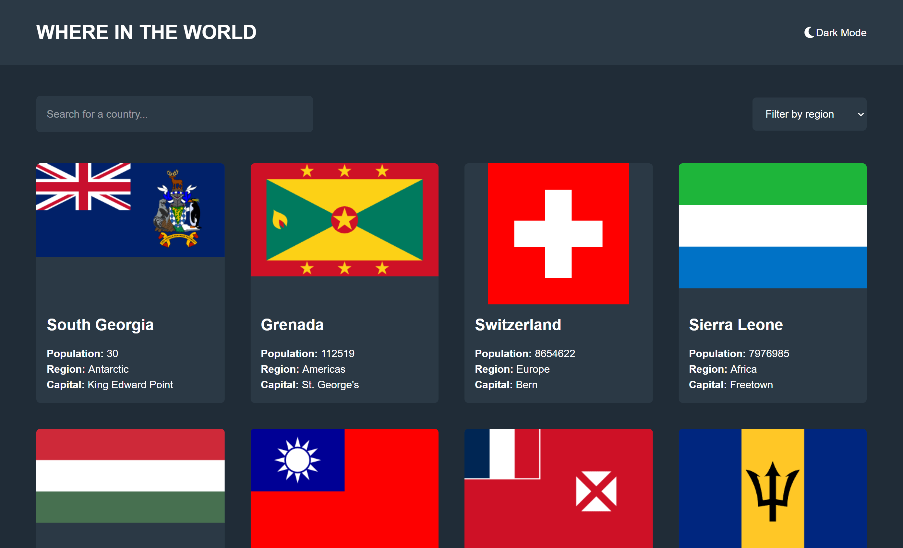

# Frontend Mentor - REST Countries API with color theme switcher solution

This is a solution to the [REST Countries API with color theme switcher challenge on Frontend Mentor](https://www.frontendmentor.io/challenges/rest-countries-api-with-color-theme-switcher-5cacc469fec04111f7b848ca). Frontend Mentor challenges help you improve your coding skills by building realistic projects. 

## Table of contents

- [Overview](#overview)
  - [The challenge](#the-challenge)
  - [Screenshot](#screenshot)
  - [Links](#links)
- [My process](#my-process)
  - [Built with](#built-with)
  - [What I learned](#what-i-learned)
- [Author](#author)

## Overview

### The challenge

Users should be able to:

- See all countries from the API on the homepage
- Search for a country using an `input` field
- Filter countries by region
- Click on a country to see more detailed information on a separate page
- Click through to the border countries on the detail page
- Toggle the color scheme between light and dark mode *(optional)*

### Screenshot

### Links

- Solution URL: [Click here](https://www.frontendmentor.io/solutions/countries-with-rest-api-oi9WE1rNIo)
- Live Site URL: [Click here](https://countries-rest-sand.vercel.app)

## My process

### Built with

- Mobile-first workflow
- [React](https://reactjs.org/) - JS library
- [Tailwind](https://tailwindcss.com/) - React framework
- [TypeScript](https://www.typescriptlang.org/) - Javascript with type safety

### What I learned

I learned using a new API along with passing params with react router. Also it's my first project with typescript so i learned about declaring types and how to use interfaces.

## Author

- Website - [Andi Gashi](https://portofolio-henna-beta.vercel.app)
- Frontend Mentor - [@Andigashi1](https://www.frontendmentor.io/profile/andigashi1)

